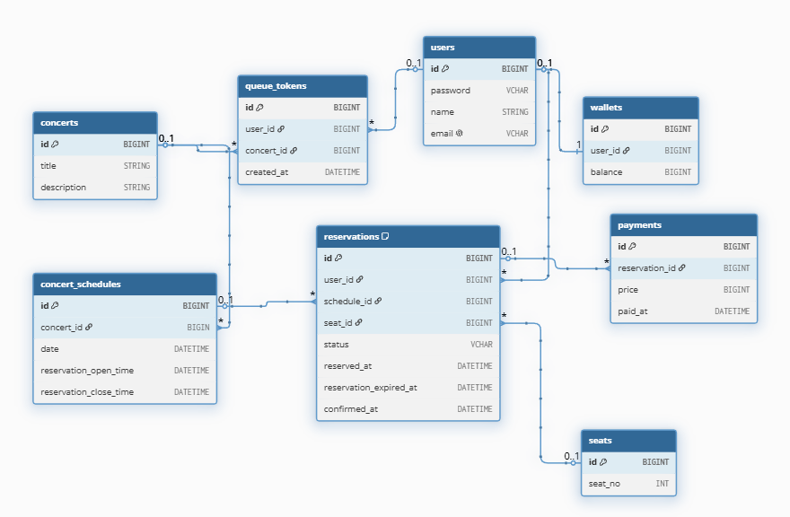

# 콘서트 예약 서비스 ERD



---
### **Concerts (콘서트 마스터)**

* 콘서트의 핵심 마스터 정보(공연명, 상세 설명)만 관리합니다.
* 실제 공연 날짜와 스케줄은 1:N 관계인 `concert_schedules` 테이블로 분리하여 데이터 중복을 방지합니다.

```sql
CREATE TABLE `concerts` (
  `id` BIGINT PRIMARY KEY,
  `title` VARCHAR(255),
  `description` TEXT
);

```

### **Concert Schedules (콘서트 일정)**

* 특정 콘서트의 회차별 날짜 및 예약 가능 스케줄을 관리합니다.
* `reservation_open_time` ~ `reservation_close_time`: 해당 회차의 티켓팅 오픈 및 마감 기간입니다.

```sql
CREATE TABLE `concert_schedules` (
  `id` BIGINT PRIMARY KEY,
  `concert_id` BIGINT,
  `date` DATETIME,
  `reservation_open_time` DATETIME,
  `reservation_close_time` DATETIME
);

```

### **Users (사용자)**

* 서비스 유저의 기본 정보를 관리합니다.
* `email` 컬럼에 UNIQUE 제약을 부여하여 중복 가입을 원천 차단합니다.

```sql
CREATE TABLE `users` (
  `id` BIGINT PRIMARY KEY,
  `password` VARCHAR(255),
  `name` VARCHAR(100),
  `email` VARCHAR(255) UNIQUE
);

```

### **Reservations (예약 및 임시 선점)**

* 사용자의 좌석 선점 및 최종 예약 정보를 관리합니다.
* **임시 예약과 확정 예약이 모두 저장되는 테이블**이며, `status` 컬럼으로 상태를 구분합니다.
* 임시 점유(`status = 'HELD'`): `reserved_at` 기준 약 5분간 유효하며, `reservation_expired_at`에 만료 시간이 기록됩니다.
* 최종 확정(`status = 'CONFIRMED'`): 결제가 성공적으로 완료된 상태이며 `confirmed_at`에 시각이 기록됩니다.
* 분산 환경에서 좌석 중복 배정을 막기 위해 데이터베이스 수준의 최종 방어선인 복합 UNIQUE INDEX(`schedule_id`, `seat_id`)를 설정합니다.

```sql
CREATE TABLE `reservations` (
  `id` BIGINT PRIMARY KEY,
  `user_id` BIGINT,
  `schedule_id` BIGINT,
  `seat_id` BIGINT,
  `status` VARCHAR(50),
  `reserved_at` DATETIME,
  `reservation_expired_at` DATETIME,
  `confirmed_at` DATETIME
);

```

### **Seats (좌석)**

* 모든 공연 회차에서 공통으로 사용할 1~50번까지의 좌석 번호를 관리하는 테이블입니다.

```sql
CREATE TABLE `seats` (
  `id` BIGINT PRIMARY KEY,
  `seat_no` INT
);

```

### **Payments (결제 이력)**

* 예약 건에 대한 결제 성공 이력을 기록합니다.
* **일대다(1:N) 관계**: 하나의 예약(`reservations_id`)에 대해 결제 시도 실패 후 재시도가 가능하도록 설계되었습니다.

```sql
CREATE TABLE `payments` (
  `id` BIGINT PRIMARY KEY,
  `reservations_id` BIGINT,
  `price` INT,
  `paid_at` DATETIME
);

```

### **Wallets (지갑)**

* 사용자별 포인트를 관리하는 테이블입니다.
* 사용자(`users`) 테이블과 **일대일(1:1) 공유 기본키(Shared PK) 구조**를 가집니다. 
* 포인트 충전 및 차감 연산 시 레이스 컨디션을 방지하기 위해, 비즈니스 로직 상에서 반드시 DB 비관적 락(`SELECT ... FOR UPDATE`)을 활용해 제어합니다.

```sql
CREATE TABLE `wallets` (
  `id` BIGINT PRIMARY KEY,
  `user_id` BIGINT,
  `balance` BIGINT
);

```
---
> ⚠️ **대기열 토큰(Queue Tokens) 테이블 제거 안내**
> 
> 초기 설계에 있던 `queue_tokens` RDB 테이블은 대규모 트래픽 시 대기 순번 업데이트(`UPDATE`) 병목 및 디스크 I/O 유발로 서버 다운의 주범이 됩니다. 따라서 고도화 요구사항에 맞춰 **Redis의 Sorted Set(ZSET) 자료구조로 전면 이관**했으므로 RDB 스키마에서는 제외합니다.

---

### **제약조건(Constraints) 및 인덱스(Indexes)**

```sql
-- [동시성 최종 방어선] 동일한 콘서트 회차의 동일한 좌석은 시스템 전역에서 단 한 명만 임시 선점/예약 가능
CREATE UNIQUE INDEX `reservations_unique_schedule_seat` ON `reservations` (`schedule_id`, `seat_id`);

-- 외래키(Foreign Key) 관계 설정 (수정된 참조 구조 반영)
ALTER TABLE `concert_schedules` ADD FOREIGN KEY (`concert_id`) REFERENCES `concerts` (`id`);

ALTER TABLE `reservations` ADD FOREIGN KEY (`user_id`) REFERENCES `users` (`id`);

-- reservations의 외래키 대상을 기존 concerts에서 -> concert_schedules로 정정 완료
ALTER TABLE `reservations` ADD FOREIGN KEY (`schedule_id`) REFERENCES `concert_schedules` (`id`);

ALTER TABLE `reservations` ADD FOREIGN KEY (`seat_id`) REFERENCES `seats` (`id`);

ALTER TABLE `wallets` ADD FOREIGN KEY (`id`) REFERENCES `users` (`id`);

ALTER TABLE `payments` ADD FOREIGN KEY (`reservations_id`) REFERENCES `reservations` (`id`);

```