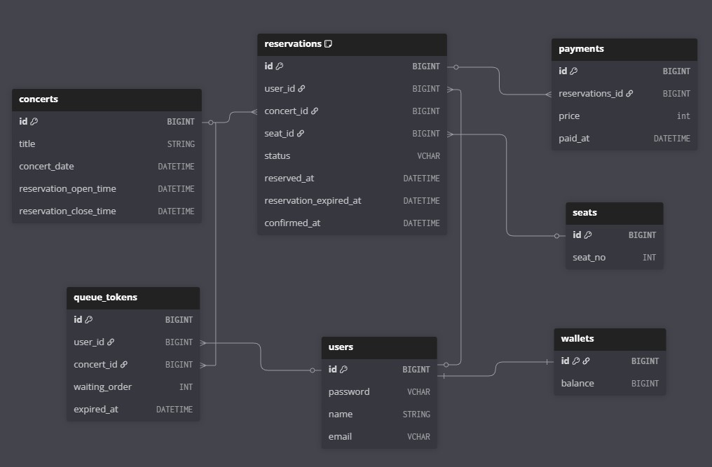

# 콘서트 예약 서비스 ERD



### **Concerts (콘서트)**
- 콘서트 기본 정보 및 예약 가능 기간 관리
- `reservation_open_time` ~ `reservation_close_time`: 예약 오픈 기간
```sql
CREATE TABLE `concerts` (
  `id` BIGINT PRIMARY KEY,
  `title` STRING,
  `concert_date` DATETIME,
  `reservation_open_time` DATETIME,
  `reservation_close_time` DATETIME
);
```
### **Users (사용자)**
- 사용자 기본 정보
- 이메일 unique 제약으로 중복 가입 방지
```sql
CREATE TABLE `users` (
  `id` BIGINT PRIMARY KEY,
  `password` VCHAR,
  `name` STRING,
  `email` VCHAR UNIQUE
);
```
### **Reservations (예약)**
- 사용자의 좌석 예약 정보
- **임시 점유**: `reserved_at` ~ `reservation_expired_at` (5분간 유효)
- **확정**: `confirmed_at` (결제 완료 시)
- `(concert_id, seat_id)` unique 제약으로 동일 좌석 중복 예약 방지
- **Status 예시**: pending → confirmed / canceled
```sql
CREATE TABLE `reservations` (
  `id` BIGINT PRIMARY KEY,
  `user_id` BIGINT,
  `concert_id` BIGINT,
  `seat_id` BIGINT,
  `status` VCHAR,
  `reserved_at` DATETIME,
  `reservation_expired_at` DATETIME,
  `confirmed_at` DATETIME
);
```
### **Seats (좌석)**
- 좌석 번호 관리 (1~50)
```sql
CREATE TABLE `seats` (
  `id` BIGINT PRIMARY KEY,
  `seat_no` INT UNIQUE
);
```
### **Payments (결제)**
- 예약에 대한 결제 이력
- **일대다 관계**: 한 예약당 여러 결제 시도 가능 (실패 시 재시도 가능하도록)
- 결제 완료 시각 기록
```sql
CREATE TABLE `payments` (
  `id` BIGINT PRIMARY KEY,
  `reservations_id` BIGINT,
  `price` int,
  `paid_at` DATETIME
);
```
### **Wallets (지갑)**
- 사용자별 잔액 관리
- 일대일 관계 (사용자당 지갑 1개)
```sql
CREATE TABLE `wallets` (
  `id` BIGINT PRIMARY KEY,
  `balance` BIGINT
);
```
### **Queue Tokens (대기열 토큰)**
- 콘서트별 예약 대기 순서 관리
- `waiting_order`: 대기 순번
- `expired_at`: 토큰 만료 시간
```sql
CREATE TABLE `queue_tokens` (
  `id` BIGINT PRIMARY KEY,
  `user_id` BIGINT,
  `concert_id` BIGINT,
  `waiting_order` INT,
  `expired_at` DATETIME
);
```
### **제약조건(Constraints) 또는 인덱스(Indexes)**
```sql
CREATE UNIQUE INDEX `reservations_index_0` ON `reservations` (`concert_id`, `seat_id`);

ALTER TABLE `reservations` ADD FOREIGN KEY (`user_id`) REFERENCES `users` (`id`);

ALTER TABLE `reservations` ADD FOREIGN KEY (`concert_id`) REFERENCES `concerts` (`id`);

ALTER TABLE `reservations` ADD FOREIGN KEY (`seat_id`) REFERENCES `seats` (`id`);

ALTER TABLE `wallets` ADD FOREIGN KEY (`id`) REFERENCES `users` (`id`);

ALTER TABLE `payments` ADD FOREIGN KEY (`reservations_id`) REFERENCES `reservations` (`id`);

ALTER TABLE `queue_tokens` ADD FOREIGN KEY (`user_id`) REFERENCES `users` (`id`);

ALTER TABLE `queue_tokens` ADD FOREIGN KEY (`concert_id`) REFERENCES `concerts` (`id`);

```