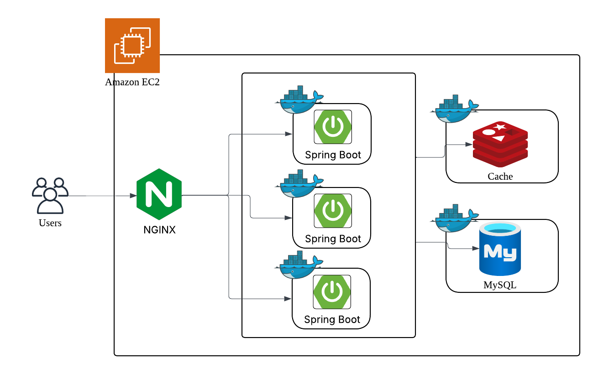

## ️인프라 구성 요소 역할

### **Amazon EC2**
- 전체 애플리케이션을 호스팅하는 가상 서버
- 클라우드 컴퓨팅 인스턴스로 확장 가능

### **Users (사용자)**
- 최종 사용자/클라이언트
- 웹 브라우저나 모바일 앱을 통해 서비스에 접근

### **NGINX**
- **리버스 프록시**: 외부 요청을 내부 서버로 전달
- **로드 밸런서**: 3개의 Spring Boot 인스턴스에 트래픽 분산
- **정적 파일 제공**: HTML, CSS, JS 등 정적 리소스 서빙
- **SSL/TLS 종료**: HTTPS 암호화 처리

### **Docker**
- **컨테이너화**: 각 Spring Boot 애플리케이션을 독립적인 컨테이너로 실행
- **격리성**: 각 인스턴스가 독립적인 환경에서 동작

### **Spring Boot**
- **애플리케이션 서버**: 비즈니스 로직 실행
- **REST API 제공**: 클라이언트 요청 처리

### **Redis (Cache)**
- **세션 관리**: 사용자 로그인 세션 저장 (여러 인스턴스 간 공유)
- **캐시 저장소**: 자주 사용되는 데이터를 메모리에 캐싱하여 성능 향상
- 대기열 토큰, 좌석 임시 배정 정보 저장

### **MySQL (Database)**
- **주 데이터베이스**: 영구 데이터 저장
- **관계형 데이터 관리**: 사용자, 주문, 상품 등의 구조화된 데이터
- 유저, 예약, 결제 등 저장